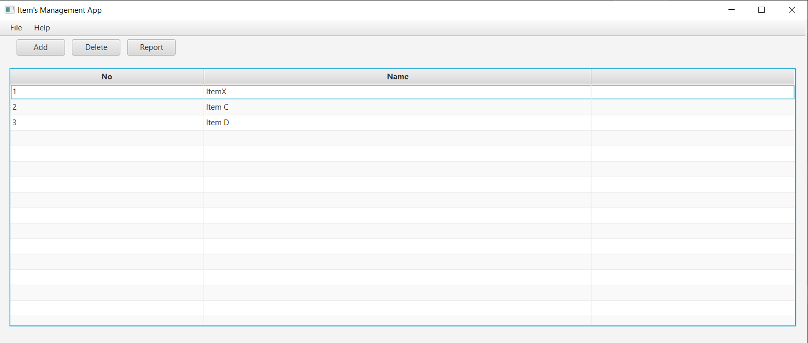
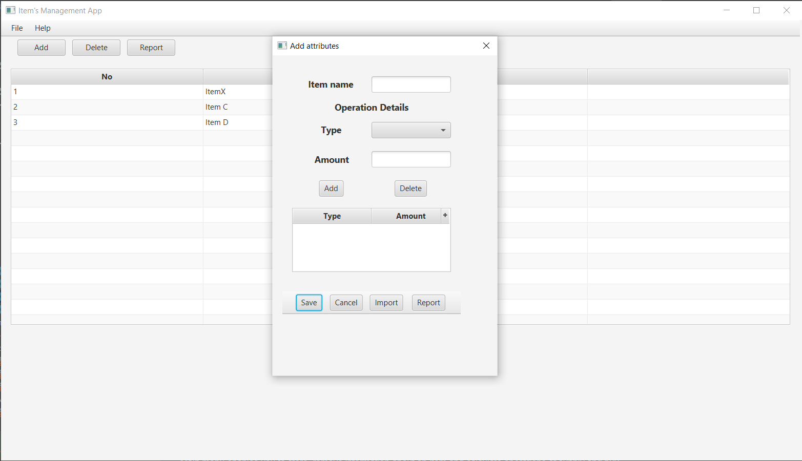
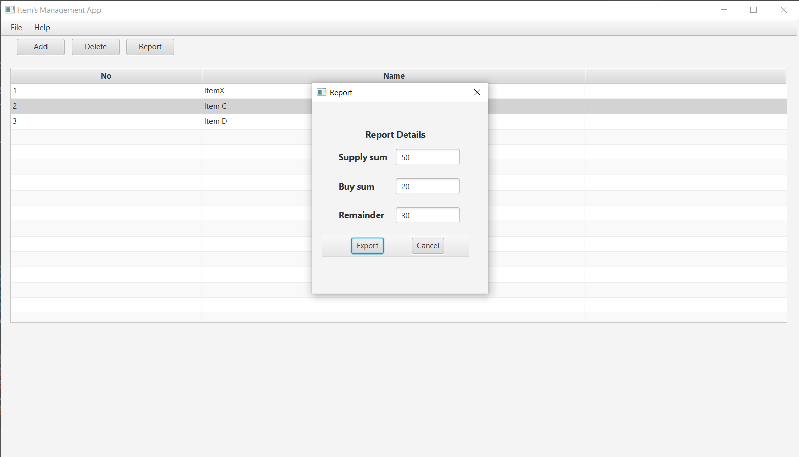

# FileHandlingApp
Application to work with csv files

Instruction how to run the application:  

A main method is included in Main class in a package com.company.filehanlingapp to run the application.  
The application enables store data, so database connection configuration is required.  
Default name of database schema is 'items_management'.  
You can find a file called hibernate.cfg.xml in subfolder META-INF in a resource folder.  
Please, change the values of properties in mentioned file according to your database engine that are listed below:  

<"hibernate.connection.url">jdbc:(your database connection)/items_management?serverTimezone=(Poland)">  
<"hibernate.connection.username">(your database username connection)>  
<"hibernate.connection.password">(your database password connection)>  
<"hibernate.dialect">(your database dialect)>  

Features of FileHandlingApp

Main menu enables you to store, remove information about an item and calculate operations of supply and buy.   

Clicking "Add" button you have access to:  
save data to database,  
calculate operations and export report to a file,  
import data from a file,  
add and remove item operations manually.  

Clicking "Report" you can check the state of supply and buy state of selected item from table (database). 